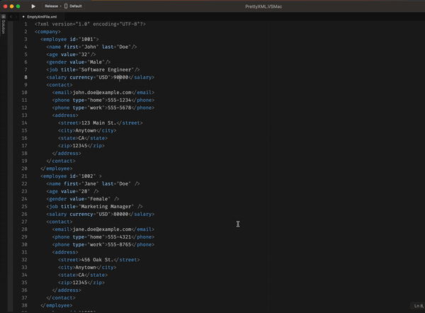

# PrettyXML.VSMac

 

 

  

Visual Studio for Mac version of [PrettyXML](https://github.com/pmahend1/PrettyXML)

Formats XML just like Windows counterpart.

## Keyboard shortcuts

- **CMD+K J** : Prettify XML  
- **CMD+K CMD+J** : Prettify XML  

  

## Installation 

- Download latest mpack from [Releases](https://github.com/pmahend1/PrettyXML.VSMac/releases/)
- Go to **Visual Studio for Mac** ➞ **Extensions...**
- Click on **Install from file...**
- Browse and open the mpack file you just downloaded
- A notification prompt will be displayd with "The following packages will be installed"
- Click on **Install**  
