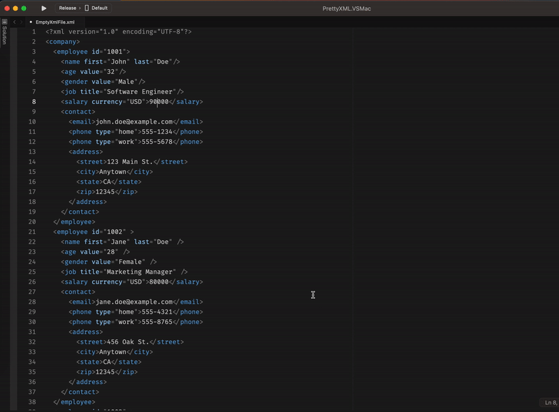

# PrettyXML.VSMac

Visual Studio for Mac version of [PrettyXML](https://github.com/pmahend1/PrettyXML)

Formats XML just like Windows counterpart.

## Keyboard shortcuts

- CMD+K J : Prettify XML
- CMD+K CMD+J : Prettify XML

